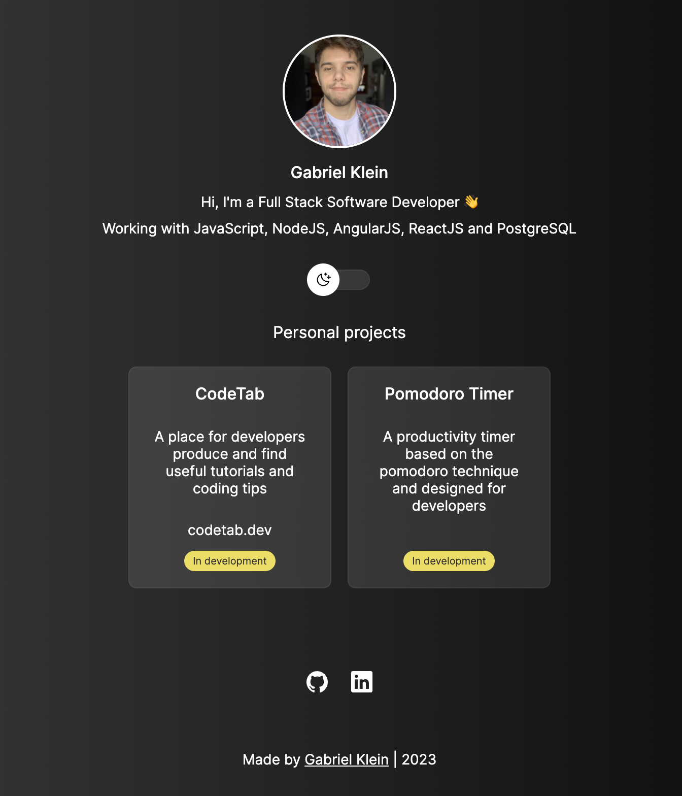

<h1 align="center"> Personal portfolio </h1>

This is my personal portfolio where I'm gonna include
all my projects, both completed and under development.

  <a href="#-techs">Techs</a>&nbsp;&nbsp;&nbsp;|&nbsp;&nbsp;&nbsp;
  <a href="#-projects">Projects</a>&nbsp;&nbsp;&nbsp;|&nbsp;&nbsp;&nbsp;
  <a href="#-social">Social</a>&nbsp;&nbsp;&nbsp;&nbsp;&nbsp;&nbsp;

 

  

## 🚀 Techs

These are the techs that I'm most familiar with:

- JavaScript
- NodeJS
- HTML and CSS
- AngularJS
- ReactJS
- PostgreSQL
- Git and Github

## 💻 Projects

Currently in my free time I'm working on two projects, which are, CodeTab and Pomodoro Timer, and I'll include every personal project that I developed here.

## 🔖 Social

You can found me both at LinkedIn, at [this link](https://linkedin.com/in/g4brielklein). And [here](https://github.com/g4brielklein) on Github. They're the only social media that I use.

Made by :wave: [Gabriel Klein](https://gabrielklein.dev)
